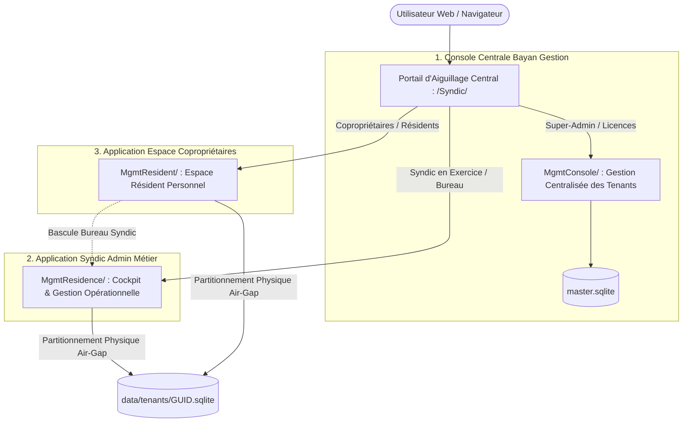
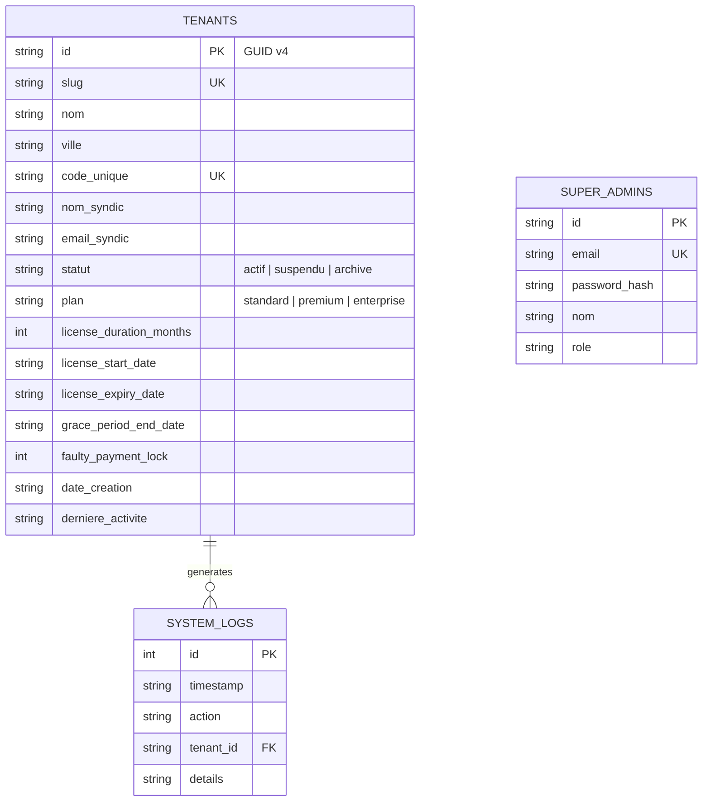
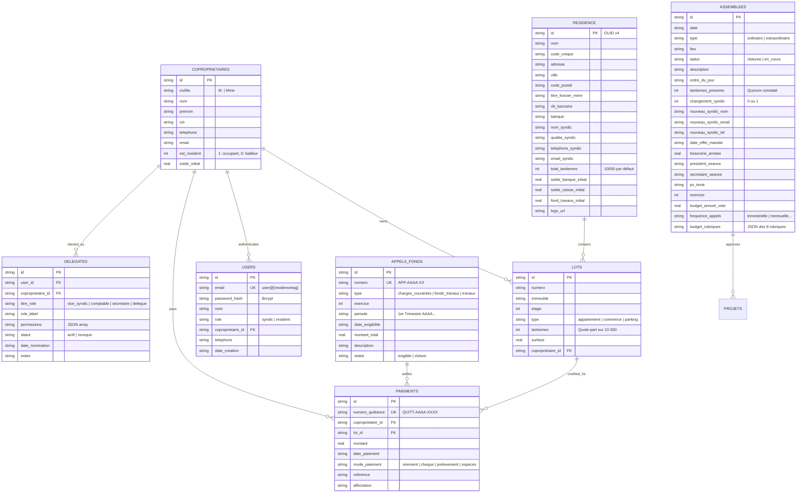

# 📘 DOCUMENTATION TECHNIQUE & FONCTIONNELLE D'ARCHITECTURE — SYNDICPRO MAROC
### Plateforme Multi-Tenant de Gestion de Copropriétés Immobilières
**Développé pour Bayan Gestion & Conforme au Dahir n° 1-02-298 du 25 Rejeb 1423 (Loi n° 18-00 relative au statut de la copropriété des immeubles bâtis au Maroc)**

---

## 📑 Sommaire Général

1. [Architecture Globale & Philosophie Tri-Applicative](#1-architecture-globale--philosophie-tri-applicative)
2. [Arborescence & Cartographie Exhaustive du Codebase](#2-arborescence--cartographie-exhaustive-du-codebase)
3. [Routage URL, Redirections Web & Sécurité Multi-Tenant](#3-routage-url-redirections-web--sécurité-multi-tenant)
4. [Modèle de Données & Schémas Relationnels SQLite](#4-modèle-de-données--schémas-relationnels-sqlite)
5. [Cadre Juridique Marocain (Dahir n° 1-02-298 & Loi n° 18-00)](#5-cadre-juridique-marocain-dahir-n-1-02-298--loi-n-18-00)
6. [Moteur Comptable & Règle d'Étanchéité Financière](#6-moteur-comptable--règle-détanchéité-financière)
7. [Guide d'Amorçage Greenfield (Onboarding Stepper)](#7-guide-damorçage-greenfield-onboarding-stepper)
8. [Gestion des Assemblées Générales & Passation de Mandat (Art. 20)](#8-gestion-des-assemblées-générales--passation-de-mandat-art-20)
9. [Délégation Syndicale & Bureau du Conseil Syndical](#9-délégation-syndicale--bureau-du-conseil-syndical)
10. [Système de Branding, Chartes Graphiques & Personnalisation](#10-système-de-branding-chartes-graphiques--personnalisation)
11. [Politique d'Application Stricte du Mode Lecture Seule (Read-Only Enforcement)](#11-politique-dapplication-stricte-du-mode-lecture-seule-read-only-enforcement)
12. [Espace Résidents & Comptes Conviviaux](#12-espace-résidents--comptes-conviviaux)
13. [Répertoire Exhaustif des Résidences & Scénarios de Démonstration](#13-répertoire-exhaustif-des-résidences--scénarios-de-démonstration)
14. [Guide de Déploiement, Configuration Serveur & Exploitation](#14-guide-de-déploiement-configuration-serveur--exploitation)

---

## 1. Architecture Globale & Philosophie Tri-Applicative

**SyndicPro Maroc** est conçu pour répondre aux exigences réelles de la gestion d'immeubles au Maroc : rapidité absolue, séparation étanche des responsabilités, conformité juridique stricte au Dahir 1-02-298 et autonomie complète de chaque copropriété.



### 🌟 Principes Directeurs
1. **Vanilla PHP 8.2+ Pur :** Aucun framework lourd (Laravel, Symfony) ni compilateur JavaScript complexe. Le temps de génération des pages est inférieur à **15 millisecondes**, assurant une fluidité maximale même sur de petits serveurs ou hébergements mutualisés.
2. **Partitionnement Physique Strict (Air-Gap) :**
   - **Base Maître (`data/master.sqlite`) :** Réservée exclusivement aux métadonnées des tenants, à la gestion des licences d'exploitation et aux logs d'audit.
   - **Bases Copropriétés (`data/tenants/{guid}.sqlite`) :** Chaque résidence dispose de son propre fichier SQLite hermétique. Aucune fuite de données inter-résidences n'est possible au niveau système.
3. **Séparation Tri-Applicative Découplée :**
   - **`MgmtConsole`** : Gestionnaire de flotte pour l'éditeur Bayan Gestion (provisioning de tenants, renouvellement de licences, supervision système).
   - **`MgmtResidence`** : Espace d'administration complet réservé au Syndic de copropriété (lots, tantièmes, appels de charges, encaissements, quittances, relances d'impayés, AG, PV, dépenses).
   - **`MgmtResident`** : Portail personnel dédié aux résidents et copropriétaires (situation comptable individuelle, historique des quittances libératoires, réclamations et suivi des interventions).

---

## 2. Arborescence & Cartographie Exhaustive du Codebase

L'application est déployée dans l'environnement Web racine (`/Syndic/`) :

```
c:\xampp\htdocs\Syndic\
├── index.php                         # Portail d'accueil unifié avec sélecteur de tenant
├── index.html.disabled               # Ancien SPA Vite désactivé (élimination des conflits 404)
├── .htaccess                         # Matrice de réécriture globale et canonicalisation
├── DOCUMENTATION.md                  # La présente documentation de référence
│
├── assets/                           # Ressources statiques communes (Tailwind CSS, Icons)
│   ├── css/
│   └── img/
│
├── data/                             # Stockage des bases de données SQLite partitionnées
│   ├── init_db.php                   # Schémas DDL et fonctions de création des bases
│   ├── master.sqlite                 # Registre maître (tenants, licences, super_admins)
│   └── tenants/                      # Répertoire des bases SQLite individuelles
│       ├── 021dfaff-5dae-4187-9a8f-8c06073c747b.sqlite  (greenwood - Vierge)
│       ├── e2b819f4-3d9a-4f51-b88e-7e9b21f98a01.sqlite  (Les Jardins de l'Atlas)
│       ├── 971a1594-a203-474e-be39-0a296fde9c22.sqlite  (Résidence Majorelle)
│       └── c7a409f1-9b8e-42c2-8751-512bfa4e7c02.sqlite  (Marina Bay Luxury)
│
├── uploads/                          # Fichiers médias téléversés
│   └── logos/
│       └── presets/                  # Armoiries héraldiques vectorielles prédéfinies
│
├── MgmtConsole/                      # APPLICATION 1 : Super Admin Bayan Gestion
│   ├── index.php                     # Dashboard de supervision de la flotte
│   ├── login.php                     # Connexion super-administrateur
│   ├── logout.php                    # Déconnexion centrale
│   ├── .htaccess                     # Routage interne de la console
│   ├── actions/
│   │   ├── provision.php             # Provisioning d'une nouvelle copropriété
│   │   ├── renew.php                 # Renouvellement de licence (+6m, +12m)
│   │   ├── toggle_status.php         # Suspension ou réactivation immédiate
│   │   └── delete_tenant.php         # Suppression sécurisée de tenant et de sa DB
│   └── includes/
│       ├── auth.php                  # Middleware de protection Super Admin
│       ├── master_db.php             # Couche d'accès aux données maître
│       ├── header.php & footer.php   # Layout d'administration centrale
│
├── MgmtResidence/                    # APPLICATION 2 : Syndic Admin & Métier Copropriété
│   ├── index.php                     # Contrôleur principal et routeur des modules
│   ├── login.php                     # Connexion Syndic et Membres du Bureau
│   ├── logout.php                    # Déconnexion et destruction de session
│   ├── quittance.php                 # Générateur PDF/HTML de quittance libératoire
│   ├── pv_assemblee.php              # Édition officielle du Procès-Verbal d'AG
│   ├── .htaccess                     # Routage des URLs conviviales /[GUID]/[page]
│   ├── actions/                      # Endpoints de traitement des formulaires (POST)
│   │   ├── add_lot.php               # Création d'un lot privatif
│   │   ├── add_coproprietaire.php    # Enregistrement copropriétaire & génération compte
│   │   ├── add_appel.php             # Émission d'un appel de fonds & ventilation lots
│   │   ├── add_paiement.php          # Saisie d'encaissement et quittance immédiate
│   │   ├── add_depense.php           # Enregistrement facture fournisseur
│   │   ├── add_assemblee.php         # Saisie AG, vote budget annuel et passation
│   │   ├── add_delegate.php          # Nomination d'un membre du conseil syndical
│   │   ├── update_settings.php       # Mise à jour RIB, raison sociale et logo
│   │   └── add_reclamation.php       # Création de ticket technique
│   ├── includes/
│   │   ├── tenant_auth.php           # Middleware de session et contrôle des rôles
│   │   ├── tenant_db.php             # Moteur de calculs comptables, tantièmes et KPIs
│   │   ├── header.php & footer.php   # Structure visuelle Bayan Gestion
│   │   └── sidebar.php               # Navigation filtrée selon les permissions
│   └── pages/                        # Vues modulaires
│       ├── dashboard.php             # KPIs cockpit, trésorerie et guide d'amorçage
│       ├── lots.php                  # Répertoire des appartements et tantièmes
│       ├── coproprietaires.php       # Liste des résidents et coordonnées
│       ├── appels.php                # Appels de charges et calcul des quotes-parts
│       ├── paiements.php             # Journal des encaissements et quittances
│       ├── relances.php              # Suivi des impayés et lettres de mise en demeure
│       ├── depenses.php              # Suivi budgétaire et factures prestataires
│       ├── assemblees.php            # Assemblées générales, vote de budget et passation
│       ├── delegues.php              # Gestion du conseil syndical et habilitations
│       ├── annexes.php               # Annexes légales 1 à 5 (Dahir 1-02-298)
│       └── settings.php              # Paramètres copropriété et personnalisation logo
│
└── MgmtResident/                     # APPLICATION 3 : Espace Résidents & Copropriétaires
    ├── index.php                     # Tableau de bord individuel du copropriétaire
    ├── login.php                     # Connexion résidents via email user@[tag]
    ├── logout.php                    # Déconnexion résident
    ├── .htaccess                     # Routage des URLs conviviales /[GUID]/resident
    ├── actions/
    │   └── add_reclamation.php       # Signalement d'incident ou panne
    ├── includes/
    │   ├── resident_auth.php         # Middleware d'isolation des résidents
    │   ├── resident_db.php           # Calculs de quote-part personnelle et solde dû
    │   ├── header.php & footer.php   # Thème adapté copropriétaire
    │   └── sidebar.php               # Navigation épurée résident
    └── pages/
        ├── dashboard.php             # Situation personnelle, tantièmes et solde exigible
        ├── paiements.php             # Historique complet des quittances téléchargeables
        ├── reclamations.php          # Déclaration et suivi des tickets techniques
        ├── assemblees.php            # Consultation des PV d'AG et résolutions votées
        ├── carnet.php                # Carnet d'entretien de l'immeuble
        └── immeuble.php              # Fiche technique de la copropriété et contacts syndic
```

---

## 3. Routage URL, Redirections Web & Sécurité Multi-Tenant

### A. Matrice de Réécriture `.htaccess`
Pour garantir des URLs propres et professionnelles sans extension `.php` visible, le serveur Apache utilise des règles de réécriture rigoureuses :

```apache
# Racine : /Syndic/.htaccess
RewriteEngine On
RewriteBase /Syndic/

# Raccourcis directs vers les logins dédiés
RewriteRule ^([a-f0-9\-]+)/resident/?$ MgmtResident/$1/login.php [L,QSA]
RewriteRule ^([a-f0-9\-]+)/login/?$ MgmtResidence/$1/login.php [L,QSA]

# Routage des 3 sous-applications
RewriteRule ^MgmtResidence/([a-f0-9\-]+)/?$ MgmtResidence/index.php?tenant=$1 [L,QSA]
RewriteRule ^MgmtResident/([a-f0-9\-]+)/?$ MgmtResident/index.php?tenant=$1 [L,QSA]
```

### B. Résolution Automatique du GUID Tenant
La classe [`TenantDB::resolveGuid()`](file:///c:/xampp/htdocs/Syndic/MgmtResidence/includes/tenant_db.php) résout l'identifiant unique de la résidence selon un ordre de priorité déterministe :
1. Paramètre explicite `$_GET['tenant']`
2. Détection dans l'URI réécrite (`/Syndic/MgmtResidence/[GUID]/...`)
3. Variable de session active `$_SESSION['tenant_id']`
4. Résolution du premier tenant actif dans `master.sqlite` à titre de fallback gracieux.

### C. Étanchéité Totale des Rôles & Redirections Absolues
Afin d'éliminer toute erreur de navigation ou boucle 404, **toutes les redirections HTTP utilisent des chemins web absolus** :
* Si un compte avec le rôle `resident` (sans délégation) tente d'accéder à `MgmtResidence/`, le middleware le renvoie instantanément vers :
  $$\mathbf{Location:\ /Syndic/MgmtResident/[GUID]/index.php}$$
* Si un compte avec le rôle `syndic` tente d'accéder à `MgmtResident/`, le système le redirige vers :
  $$\mathbf{Location:\ /Syndic/MgmtResidence/[GUID]/index.php}$$

---

## 4. Modèle de Données & Schémas Relationnels SQLite

### A. Registre Maître (`data/master.sqlite`)



### B. Base Dédiée de Copropriété (`data/tenants/{guid}.sqlite`)



---

## 5. Cadre Juridique Marocain (Dahir n° 1-02-298 & Loi n° 18-00)

L'architecture métier de SyndicPro Maroc respecte scrupuleusement les exigences du Dahir n° 1-02-298 :

| Article de Loi | Exigence Légale | Implémentation Logicielle dans SyndicPro |
|---|---|---|
| **Article 16 à 19** | **Assemblées Générales & Quorum** | Constat automatique du quorum légal basé sur les tantièmes réels. Distinction stricte entre AGO annuelle et AGE extraordinaire. |
| **Article 18** | **Fonds de Travaux Obligatoire** | Suivi sanctuarisé d'une réserve pour travaux futurs (minimum légal de 5% du budget annuel), isolée de la trésorerie d'exploitation courante. |
| **Article 20** | **Passation de Mandat du Syndic** | Assistant complet de passation : élection du nouveau syndic, mise à jour des accès, PV officiel, bordereau de remise des archives et arrêté contradictoire de trésorerie. |
| **Article 25** | **Recouvrement & Mise en Demeure** | Détection automatique des retards d'échéance. Génération de lettres de relance formelles et mise en demeure avec accusé de réception / sommation pré-contentieuse. |
| **Article 36 & 37** | **Répartition des Charges par Tantièmes** | Ventilation mathématique stricte de chaque centime appelé au prorata des quotes-parts de parties communes sur 10 000 tantièmes. |

---

## 6. Moteur Comptable & Règle d'Étanchéité Financière

### A. Règle d'Or : Aucune Dette Fictive en Greenfield
Dans le droit de la copropriété au Maroc, **aucune créance ne peut exister de manière abstraite sans appel de fonds émis**.
* **Suppression Totale des Fallbacks :** Tous les mécanismes de repli arbitraire (ex: 50 000 DH ou 100 000 DH) ont été définitivement supprimés du code.
* Une résidence nouvellement provisionnée affiche **0,00 DH** de charges appelées, **0,00 DH** d'impayés et un taux de recouvrement à **100%**.

### B. Formule de Ventilation des Cotisations
Lors de l'émission d'un appel de fonds d'un montant total $M$, la quote-part exigible $Q_i$ de chaque appartement $i$ est calculée en temps réel selon la formule :

$$Q_i = M \times \left(\frac{\text{Tantièmes}_i}{\sum_{k=1}^N \text{Tantièmes}_k}\right)$$

### C. Tableau de Bord Financier Exécutif (Cockpit)
La méthode [`TenantDB::getFinancialCockpit(?int $exercice)`](file:///c:/xampp/htdocs/Syndic/MgmtResidence/includes/tenant_db.php) calcule les 4 métriques fondamentales :
1. **Trésorerie Disponible :** $\text{Solde Banque Initial} + \text{Total Encaissé} - \text{Total Dépenses Payées}$.
2. **Total des Charges Appelées :** $\sum \text{Montants des appels\_fonds émis sur l'exercice}$.
3. **Total des Impayés :** $\max(0, \text{Total Appelé} - \text{Total Encaissé})$.
4. **Taux de Recouvrement :** $\frac{\text{Total Encaissé}}{\text{Total Appelé}} \times 100$ (ou $100\%$ si aucun appel n'a encore été émis).

### D. Annexes Légales 1 à 5
Accessibles depuis la page [`annexes.php`](file:///c:/xampp/htdocs/Syndic/MgmtResidence/pages/annexes.php) avec mise en page optimisée pour l'impression A4 :
* **Annexe 1 :** Tableau de Situation Financière & Trésorerie (Actif / Passif / Réserve Fonds Travaux).
* **Annexe 2 :** Compte de Gestion Général des Charges Courantes (ventilé par poste de dépense).
* **Annexe 3 :** Compte de Gestion des Travaux & Opérations Exceptionnelles.
* **Annexe 4 :** État des Dettes & Créances des Copropriétaires à la clôture de l'exercice.
* **Annexe 5 :** Budget Prévisionnel Comparatif (Réalisé N vs Voté N+1).

---

## 7. Guide d'Amorçage Greenfield (Onboarding Stepper)

Pour tout nouveau tenant (ex: `greenwood`), le tableau de bord affiche un **Guide d'Amorçage de la Copropriété** en 4 étapes séquentielles :

```
   ┌──────────────────────┐      ┌──────────────────────┐
   │ 1. CONFIGURER LOTS   │ ───► │ 2. COPROPRIÉTAIRES   │
   │ Saisie des tantièmes │      │ Création des comptes │
   └──────────────────────┘      └──────────────────────┘
              │                             │
              ▼                             ▼
   ┌──────────────────────┐      ┌──────────────────────┐
   │ 3. VOTE BUDGET AG    │ ───► │ 4. APPEL DE FONDS    │
   │ Budget annuel voté   │      │ Cotisations dues     │
   └──────────────────────┘      └──────────────────────┘
```

1. **Étape 1 &bull; Lots & Tantièmes ([`lots.php`](file:///c:/xampp/htdocs/Syndic/MgmtResidence/pages/lots.php)) :** Saisie des appartements et pondération sur un total de 10 000 tantièmes.
2. **Étape 2 &bull; Copropriétaires ([`coproprietaires.php`](file:///c:/xampp/htdocs/Syndic/MgmtResidence/pages/coproprietaires.php)) :** Rapprochement des résidents avec leurs lots et génération automatique des identifiants conviviaux `prenom.nom@[tag]`.
3. **Étape 3 &bull; Assemblée Générale ([`assemblees.php`](file:///c:/xampp/htdocs/Syndic/MgmtResidence/pages/assemblees.php)) :** Enregistrement de l'AG constitutive, vote du budget prévisionnel annuel, choix de la périodicité et ventilation sur les 8 rubriques.
4. **Étape 4 &bull; Émission des Appels ([`appels.php`](file:///c:/xampp/htdocs/Syndic/MgmtResidence/pages/appels.php)) :** Calcul instantané de la quote-part due par chaque appartement et notification des cotisations exigibles.

---

## 8. Gestion des Assemblées Générales & Passation de Mandat (Art. 20)

### A. Vote du Budget Prévisionnel Annuel & Rubriques Standard
Dans le formulaire d'AG ([`assemblees.php`](file:///c:/xampp/htdocs/Syndic/MgmtResidence/pages/assemblees.php)), le syndic renseigne :
* **Exercice Budgétaire :** Par défaut l'exercice en cours.
* **Budget Annuel Voté Total (DH TTC) :** Montant de base validé en délibération.
* **Périodicité des Appels :** Mensuelle (12 appels), Trimestrielle (4 appels - standard), Semestrielle (2 appels) ou Annuelle (1 appel).
* **Ventilation sur les 8 Rubriques Réglementaires :**
  1. *Gardiennage & Sécurité*
  2. *Nettoyage & Hygiène*
  3. *Électricité des parties communes*
  4. *Eau & Arrosage des espaces verts*
  5. *Maintenance Ascenseur (Contrat préventif)*
  6. *Assurance Multirisque Copropriété*
  7. *Honoraires de Gestion & Syndic*
  8. *Dotation Réserve Fonds Travaux (Art. 18)*

### B. Protocole de Passation d'Exercice (Changement de Syndic)
Conformément à l'Article 20 de la Loi 18-00, si l'AG élit un nouveau syndic :
1. Le formulaire déploie la section spéciale **Élection d'un Nouveau Syndic**.
2. Le système crée immédiatement le nouveau compte administrateur sécurisé.
3. Les fiches de la résidence (nom, email, téléphone du syndic) sont mises à jour automatiquement.
4. Un log d'audit infalsifiable `PASSATION_SYNDIC` est inscrit dans `master.sqlite`.
5. Le Procès-Verbal officiel ([`pv_assemblee.php`](file:///c:/xampp/htdocs/Syndic/MgmtResidence/pv_assemblee.php)) génère l'inventaire contradictoire et le bordereau de remise des archives.

---

## 9. Délégation Syndicale & Bureau du Conseil Syndical

### A. Structure et Éligibilité
Conformément aux Articles 18 et 26 de la Loi 18-00, le syndic en titre peut habiliter des copropriétaires au sein d'un bureau délégué :
* **Éligibilité Stricte :** Seuls les copropriétaires enregistrés dans la résidence peuvent être désignés (`getEligibleResidentsForDelegation()`).
* **Table `delegates` :** Stocke les attributions, le titre et le JSON des permissions accordées.

### B. Profils Types de Rôles

| Profil Type | Titre Rôle | Modules Autorisés Recommandés |
|---|---|---|
| **Vice-Syndic Adjoint** | `vice_syndic` | Tous les modules opérationnels (Lots, Copropriétaires, Appels, Paiements, Relances, Dépenses, AG, Réclamations, Carnet) |
| **Comptable / Trésorier** | `comptable` | Modules financiers & comptables (Dashboard, Appels, Paiements/Quittances, Dépenses, Fournisseurs) |
| **Secrétaire Général** | `secretaire` | Modules administratifs (Assemblées Générales, Réclamations, Carnet d'entretien, Projets) |
| **Membre Délégué** | `delegue` | Sélection sur-mesure de modules |

### C. Double Navigation Résident $\longleftrightarrow$ Bureau Syndic
Lorsqu'un copropriétaire délégué est connecté dans son Espace Résident (`MgmtResident`), un badge interactif doré `👑 Bureau Syndic (Titre)` s'affiche dans son en-tête, lui permettant de basculer instantanément dans l'interface de gestion sans ressaisir son mot de passe.

---

## 10. Système de Branding, Chartes Graphiques & Personnalisation

### A. Palette Officielle Bayan Gestion
L'ensemble de l'interface respecte la charte chromatique de l'application :
* **Fond Nuit Exécutif :** `#1E0427`
* **Accent Magenta Royal :** `#D91C6E`
* **Corail Lumineux :** `#F26968`
* **Orange Énergie :** `#F27835`
* **Blanc Chaud / Toile de Fond :** `#FDF8F5`

### B. Générateur Automatique d'Armoiries Vectorielles (SVG Placeholder)
Pour toute nouvelle copropriété provisionnée qui n'a pas encore téléversé son propre logo, la fonction [`TenantDB::getResidenceLogo()`](file:///c:/xampp/htdocs/Syndic/MgmtResidence/includes/tenant_db.php) génère à la volée des armoiries héraldiques vectorielles SVG aux couleurs de Bayan Gestion avec les initiales de la résidence.

### C. Personnalisation par le Syndic
Depuis [`settings.php`](file:///c:/xampp/htdocs/Syndic/MgmtResidence/pages/settings.php), le syndic peut à tout moment importer le logo officiel de son immeuble (formats PNG, JPG, WebP jusqu'à 4 Mo). Le logo personnalisé remplace instantanément le placeholder sur les écrans de connexion, les quittances et les PV d'assemblée.

---

## 11. Politique d'Application Stricte du Mode Lecture Seule (Read-Only Enforcement)

Lorsqu'une licence de copropriété arrive à expiration ou qu'un verrou d'impayé est activé par Bayan Gestion, le système applique un verrouillage hermétique :
1. **Contrôle Middleware PHP :** Toute invocation d'une méthode de mutation (`addLot`, `addPaiement`, `addAppel`, `addDepense`, etc.) déclenche `TenantDB::checkWritePermission()`, interceptant la requête et redirigeant avec `error=read_only_mode`.
2. **Désactivation Visuelle :** Tous les boutons d'action (ex: *➕ Émettre un Appel*, *➕ Enregistrer un Paiement*) sont remplacés par un badge explicatif avec cadenas `🔒 Lecture Seule`.
3. **Préservation Totale de la Consultation :** Les résidents et le syndic conservent l'accès complet à la consultation des données, au téléchargement des quittances antérieures et à l'impression des annexes.

---

## 12. Espace Résidents & Comptes Conviviaux

### A. Format des Identifiants Résidents
Chaque copropriétaire dispose d'un identifiant universel au format :
$$\mathbf{prenom.nom@[tag\_residence]}$$
*(Exemples : `mehdi.elamrani@atlas`, `amine.tazi@majorelle`, `kenza.berrada@marinabay`).*
Le mot de passe par défaut est : `resident2026`.

### B. Cockpit Individuel du Copropriétaire ([`MgmtResident/pages/dashboard.php`](file:///c:/xampp/htdocs/Syndic/MgmtResident/pages/dashboard.php))
* **Synthèse Financière Personnelle :** Total appelé, total versé, quote-part en tantièmes, et solde net restant dû.
* **Badge de Situation :** `À JOUR (0,00 DH)` en vert émeraude, ou `EN ATTENTE DE RÈGLEMENT` avec détail du montant en rouge corail.
* **Téléchargement Immédiat des Quittances :** Accès direct à toutes les quittances libératoires certifiées conformes au Dahir n° 1-02-298.
* **Tickets d'Incidents :** Formulaire de déclaration avec upload de photos et historique des interventions du syndic.

---

## 13. Répertoire Exhaustif des Résidences & Scénarios de Démonstration

L'environnement intègre 4 résidences illustrant l'ensemble des cas d'usage métiers :

### 🏢 Matrice Synthétique des Copropriétés

| Résidence | Ville | GUID Unique | Identifiant Syndic | Mot de Passe | Tantièmes | Statut Scénario |
|---|---|---|---|---|---|---|
| **Les Jardins de l'Atlas** | Casablanca | `e2b819f4-3d9a-4f51-b88e-7e9b21f98a01` | `syndic.yassine.bennani@gmail.com` | `syndic2026` | 10 000 | Peuplée (5 scénarios) |
| **Résidence Majorelle** | Marrakech | `971a1594-a203-474e-be39-0a296fde9c22` | `syndic.majorelle@gmail.com` | `syndic2026` | 10 000 | Peuplée (4 scénarios) |
| **Marina Bay Luxury** | Tanger | `c7a409f1-9b8e-42c2-8751-512bfa4e7c02` | `syndic.marinabay@gmail.com` | `syndic2026` | 10 000 | Peuplée (4 scénarios) |
| **greenwood** | Casablanca | `021dfaff-5dae-4187-9a8f-8c06073c747b` | `tawfik@gmail.com` | `syndic2026` | 10 000 | **100% Vierge (Greenfield)** |

---

### 📋 Détail des Comptes Résidents & Scénarios Fictifs par Résidence

#### 1. Résidence Les Jardins de l'Atlas (Casablanca — `@atlas`)
*Budget Annuel Voté en AG : 144 000 DH &bull; Appels Trimestriels Émis (Q1 + Q2) : 72 000 DH*

| Copropriétaire | Lot & Étage | Tantièmes | Identifiant (Login) | Mot de Passe | Appelé | Payé | Reste Dû | Scénario Métier Illustré |
|---|---|---|---|---|---|---|---|---|
| **Mehdi EL AMRANI** | Lot 101 (Étage 1) | 1 500 / 10 000 | `mehdi.elamrani@atlas` | `resident2026` | 10 800 DH | 10 800 DH | **0,00 DH** | **À Jour & Quittances Récentes :** Paiements ponctuels, quittances officielles générées. |
| **Fatima Zahra BENSLIMANE** | Lot 202 (Étage 2) | 1 800 / 10 000 | `fatima.benslimane@atlas` | `resident2026` | 12 960 DH | 12 960 DH | **0,00 DH** | **Mise à Jour de Compte (Account Update) :** Coordonnées actualisées, RIB et prélèvement actif. |
| **Omar CHRAIBI** | Lot 301 (Étage 3) | 2 000 / 10 000 | `omar.chraibi@atlas` | `resident2026` | 14 400 DH | 7 200 DH | **7 200 DH** | **Retard Simple (Due Paiement) :** Q1 payé, Q2 en retard. Relance niveau 1 (rappel amiable). |
| **Karim BENJELLOUN** | Lot 401 (Penthouse) | 2 500 / 10 000 | `karim.benjelloun@atlas` | `resident2026` | 18 000 DH | 0,00 DH | **18 000 DH** | **Mise en Demeure (Art. 25 Loi 18-00) :** Contentieux lourd, arriérés persistants, sommation formelle. |
| **Tariq ALAMI** | Lot 102 (Étage 1) | 2 200 / 10 000 | `tariq.alami@atlas` | `resident2026` | 15 840 DH | 15 840 DH | **0,00 DH** | **Délégué Vice-Syndic :** Membre du bureau avec permissions opérationnelles et double accès. |

---

#### 2. Résidence Majorelle (Marrakech — `@majorelle`)
*Budget Annuel Voté en AG : 180 000 DH &bull; Appels Trimestriels Émis (Q1 + Q2) : 90 000 DH*

| Copropriétaire | Lot & Étage | Tantièmes | Identifiant (Login) | Mot de Passe | Appelé | Payé | Reste Dû | Scénario Métier Illustré |
|---|---|---|---|---|---|---|---|---|
| **Amine TAZI** | Riad 1 (RDC) | 2 500 / 10 000 | `amine.tazi@majorelle` | `resident2026` | 22 500 DH | 22 500 DH | **0,00 DH** | **Délégué Trésorier / Comptable :** Accès aux modules comptabilité, à jour de ses cotisations. |
| **Leila KABBAJ** | Apt 201 (Étage 2) | 2 000 / 10 000 | `leila.kabbaj@majorelle` | `resident2026` | 18 000 DH | 18 000 DH | **0,00 DH** | **Réclamation Technique en Cours :** Signalement d'infiltration toiture terrasse, intervention programmée. |
| **Reda IDRISSI** | Apt 301 (Étage 3) | 2 500 / 10 000 | `reda.idrissi@majorelle` | `resident2026` | 22 500 DH | 12 500 DH | **10 000 DH** | **Paiement Partiel :** Versement d'acomptes, solde intermédiaire en attente de régularisation. |
| **Hicham BOUSSAID** | Apt 401 (Penthouse) | 3 000 / 10 000 | `hicham.boussaid@majorelle` | `resident2026` | 27 000 DH | 0,00 DH | **27 000 DH** | **Mise en Demeure & Recouvrement Forcé :** Procédure d'injonction de payer en cours d'instruction. |

---

#### 3. Résidence Marina Bay Luxury (Tanger — `@marinabay`)
*Budget Annuel Voté en AG : 240 000 DH &bull; Appels Trimestriels Émis (Q1 + Q2) : 120 000 DH*

| Copropriétaire | Lot & Étage | Tantièmes | Identifiant (Login) | Mot de Passe | Appelé | Payé | Reste Dû | Scénario Métier Illustré |
|---|---|---|---|---|---|---|---|---|
| **Kenza BERRADA** | Penthouse 1 (Étage 8)| 3 000 / 10 000 | `kenza.berrada@marinabay` | `resident2026` | 36 000 DH | 36 000 DH | **0,00 DH** | **Déléguée Secrétaire Générale :** Habilitation sur registres d'AG et PV, cotisations à jour. |
| **Driss SLAOUI** | Apt 202 (Étage 2) | 2 500 / 10 000 | `driss.slaoui@marinabay` | `resident2026` | 30 000 DH | 30 000 DH | **0,00 DH** | **Bailleur Non-Occupant (MRE) :** Résidence secondaire, coordonnées internationales et virement SWIFT. |
| **Nabil FILALI** | Apt 303 (Étage 3) | 2 000 / 10 000 | `nabil.filali@marinabay` | `resident2026` | 24 000 DH | 12 000 DH | **12 000 DH** | **Dû Paiement Trimestriel Récent :** Q2 dépassé de 15 jours, relance automatique du syndic. |
| **Saad MANSOURI** | Apt 404 (Étage 4) | 2 500 / 10 000 | `saad.mansouri@marinabay` | `resident2026` | 30 000 DH | 0,00 DH | **30 000 DH** | **Contentieux / Avocat :** Commandement de payer extrajudiciaire notifié par huissier de justice. |

---

#### 4. Copropriété Greenwood Victoria City (`greenwood`)
*GUID : `021dfaff-5dae-4187-9a8f-8c06073c747b` &bull; Syndic : `tawfik@gmail.com` / `syndic2026`*
* **Statut :** **TOTALEMENT VIERGE (0 Lots, 0 Résidents, 0 Appels, 0,00 DH de créances).**
* **Objectif de Démonstration :** Permet à l'utilisateur de tester en conditions réelles le **Guide d'Amorçage en 4 Étapes** : création d'appartements, saisie de copropriétaires, enregistrement d'une Assemblée Générale avec vote du budget annuel et émission d'un appel de fonds calculant les quotes-parts en direct.

---

## 14. Guide de Déploiement, Configuration Serveur & Exploitation

### A. Prérequis Techniques
* **PHP :** Version 8.2.0 ou supérieure avec extensions : `pdo_sqlite`, `gd`, `curl`, `mbstring`, `json`.
* **Serveur Web :** Apache 2.4+ avec module `mod_rewrite` activé.
* **Système d'Exploitation :** Windows (XAMPP / WampServer) ou Linux (Ubuntu / Debian / AlmaLinux).

### B. Configuration Apache / XAMPP
Dans le fichier `httpd.conf` ou la configuration du VirtualHost, s'assurer que les directives `AllowOverride All` sont actives :

```apache
<Directory "C:/xampp/htdocs/Syndic">
    Options -Indexes +FollowSymLinks
    AllowOverride All
    Require all granted
</Directory>
```

### C. Procédure de Sauvegarde à Chaud (Hot Backup)
Grâce au partitionnement SQLite, la sauvegarde d'une copropriété ou de l'ensemble de la plateforme s'effectue par simple copie de fichiers sans interrompre le service :

```powershell
# Sauvegarde complète vers dossier de backup horodaté
$date = Get-Date -Format "yyyy-MM-dd_HH-mm"
Copy-Item -Recurse "C:\xampp\htdocs\Syndic\data" "C:\Backups\Syndic_$date"
```

### D. Déploiement Automatisé sur VPS OVH (Ubuntu / Debian)
Le dossier [`deploy/`](file:///c:/xampp/htdocs/Syndic/deploy) contient un outillage complet pour déployer la plateforme en production :
* **Script d'installation One-Liner Bash :** [`setup_ovh_vps.sh`](file:///c:/xampp/htdocs/Syndic/deploy/setup_ovh_vps.sh) (installation Apache 2.4, PHP 8.2+, UFW, Fail2ban, SSL Let's Encrypt et cron de sauvegarde).
* **Script de déploiement à distance PowerShell :** [`pack_and_deploy.ps1`](file:///c:/xampp/htdocs/Syndic/deploy/pack_and_deploy.ps1) (génération de `syndic_production.tar.gz`, transfert SCP et exécution SSH directe).
* **Conteneurisation Docker :** [`Dockerfile`](file:///c:/xampp/htdocs/Syndic/deploy/Dockerfile) et [`docker-compose.yml`](file:///c:/xampp/htdocs/Syndic/deploy/docker-compose.yml).
* **Manuel détaillé pas-à-pas :** [`DEPLOY_OVH_GUIDE.md`](file:///c:/xampp/htdocs/Syndic/deploy/DEPLOY_OVH_GUIDE.md).

```powershell
# Déploiement direct vers l'IP de votre VPS OVH depuis PowerShell
cd C:\xampp\htdocs\Syndic\deploy
.\pack_and_deploy.ps1 -VpsIp <VOTRE_IP_VPS> -Domain syndic.votredomaine.ma
```

### E. Sécurisation en Environnement de Production
1. **Verrouillage de l'Accès Direct aux Fichiers SQLite :** Le fichier `data/.htaccess` bloque expressément tout téléchargement direct des fichiers `.sqlite` (HTTP 403 Forbidden).
2. **Protection des Dossiers Médias :** Le fichier `uploads/.htaccess` interdit l'exécution de tout script (PHP, shell) dans les dossiers de médias.
3. **Chiffrement des Transmissions :** Activation obligatoire de HTTPS (certificat TLS Let's Encrypt ou commercial).
4. **Mots de Passe Hachés :** Hachage Bcrypt systématique avec coût 10 par défaut.

---
*Documentation technique de référence — Bayan Gestion / SyndicPro Maroc &bull; Conforme Dahir n° 1-02-298 (Loi 18-00).*
